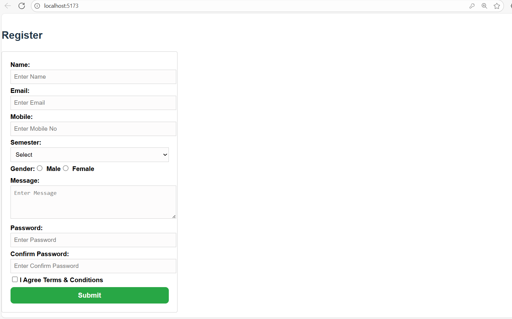

# Registration Form - React + Vite

[](https://reactjs.org/)
[](https://vitejs.dev/)
[](https://eslint.org/)
[](https://incandescent-fenglisu-09dadc.netlify.app/)

A comprehensive registration form built with React and Vite, featuring input validation, state management, and local storage integration. Perfect for learning form handling in React class components.

## Features

- Complete Registration Form: Collects user details including name, email, mobile, semester, gender, message, and passwords.
- Input Validation: Real-time validation for required fields, email format, mobile number, and password matching.
- Password Confirmation: Ensures passwords match before submission.
- Local Storage: Saves registration data to browser's local storage.
- Styled UI: Clean, responsive design with Tailwind CSS classes.
- Vite Dev Server: Fast development with Hot Module Replacement (HMR).
- ESLint Integration: Code quality and consistency checks.

## Quick Start

### Prerequisites

- Node.js 18+ (download from [nodejs.org](https://nodejs.org/))
- npm (comes bundled with Node.js)

### Installation

1. Clone or Download the repository:
   ```bash
   git clone https://github.com/yourusername/react-registration-form.git
   cd react-registration-form
   ```

2. Install Dependencies:
   ```bash
   npm install
   ```

3. Start Development Server:
   ```bash
   npm run dev
   ```

4. Open in Browser:
   - Navigate to `http://localhost:5173` (or the URL displayed in your terminal)
   - Fill out the registration form!

## Usage



1. Fill Form: Enter all required information (name, email, mobile, etc.).
2. Select Options: Choose semester and gender.
3. Agree to Terms: Check the agreement checkbox.
4. Submit: Click submit to validate and save data.
5. Success: On successful submission, data is saved to localStorage and form resets.

### Validation Rules
- All fields are required.
- Email must contain '@' and '.'.
- Mobile must be exactly 10 digits.
- Passwords must match.
- Terms agreement is mandatory.

## Project Structure

```
RegistrationFormCharusatReact/
├── public/
│   └── vite.svg
├── src/
│   ├── assets/
│   │   └── react.svg
│   ├── App.css
│   ├── App.jsx          # Main app component
│   ├── index.css
│   ├── main.jsx         # App entry point
│   └── RegisterForm.jsx # Registration form component
├── index.html
├── package.json
├── vite.config.js
├── eslint.config.js
├── TEXT.txt
└── README.md
```

## Available Scripts

| Command | Description |
|---------|-------------|
| `npm run dev` | Start development server with HMR |
| `npm run build` | Build for production |
| `npm run lint` | Run ESLint for code quality |
| `npm run preview` | Preview production build locally |

## Technologies Used

- [React 19](https://reactjs.org/): UI library with class components
- [Vite 7](https://vitejs.dev/): Next-generation frontend tooling
- [ESLint](https://eslint.org/): Pluggable linting utility
- Tailwind CSS: Utility-first CSS framework (via classes)
- Local Storage: Browser storage API

## Deployment

This project is deployed on Netlify: [https://incandescent-fenglisu-09dadc.netlify.app/](https://incandescent-fenglisu-09dadc.netlify.app/)

## Contributing

Contributions are welcome! Please follow these steps:

1. Fork the repository
2. Create a feature branch: `git checkout -b feature/new-feature`
3. Commit changes: `git commit -m 'Add new feature'`
4. Push to branch: `git push origin feature/new-feature`
5. Open a Pull Request

### Development Guidelines
- Run `npm run lint` before committing
- Follow React best practices
- Test form validation thoroughly
- Update documentation for new features

## License

This project is licensed under the MIT License.

## FAQ

Q: Why use class components?  
A: Demonstrates traditional React patterns. Modern apps often use functional components with hooks.

Q: How to add more fields?  
A: Update the state object in `RegisterForm.jsx` and add corresponding form elements.

Q: Data persistence?  
A: Currently uses localStorage. For production, integrate with a backend API.

Q: Styling?  
A: Uses Tailwind CSS classes. Customize in `App.css` or add a full Tailwind config.

## Support

For questions or issues:
- Open an issue on GitHub
- Check [React Docs](https://reactjs.org/docs/)
- Review [Vite Guide](https://vitejs.dev/guide/)

---

Built with love for learning React forms
